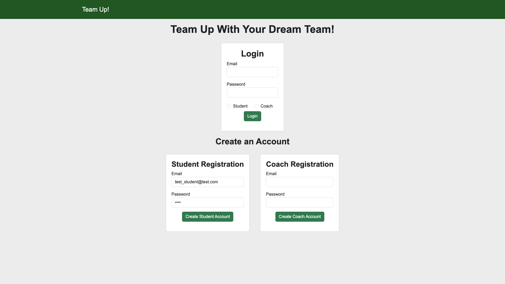
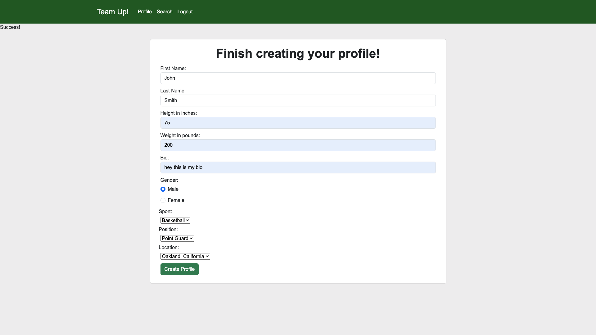
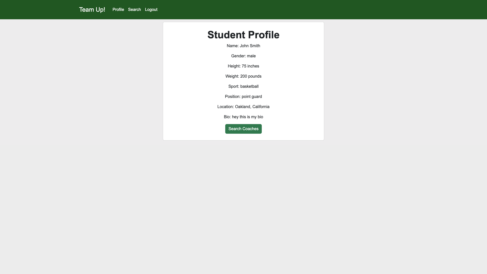
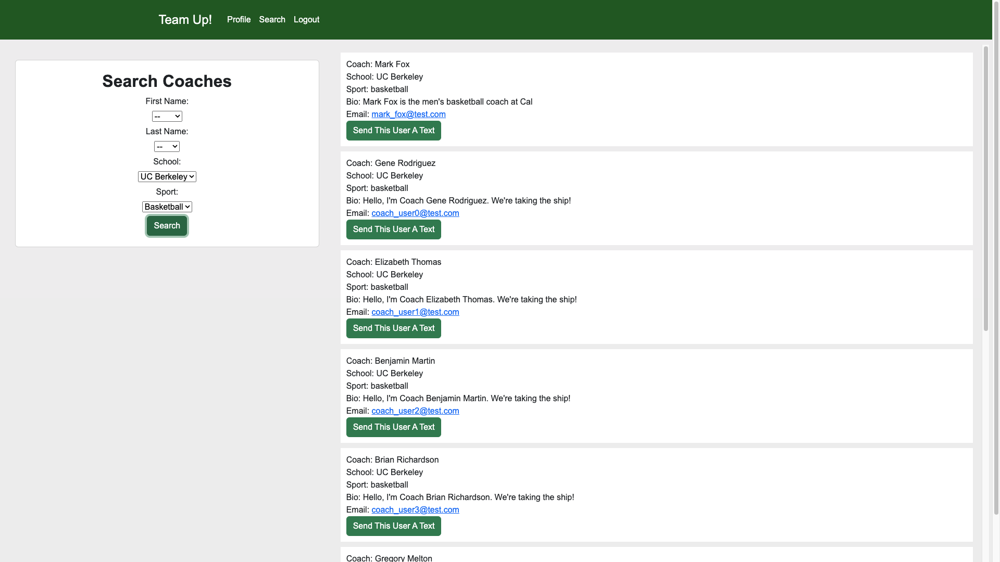
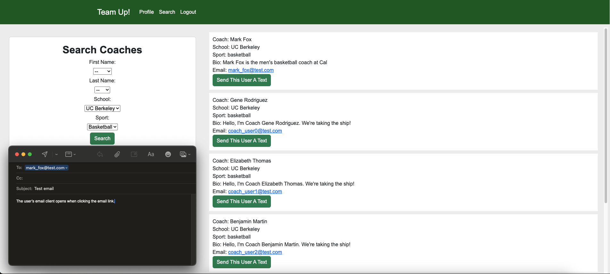
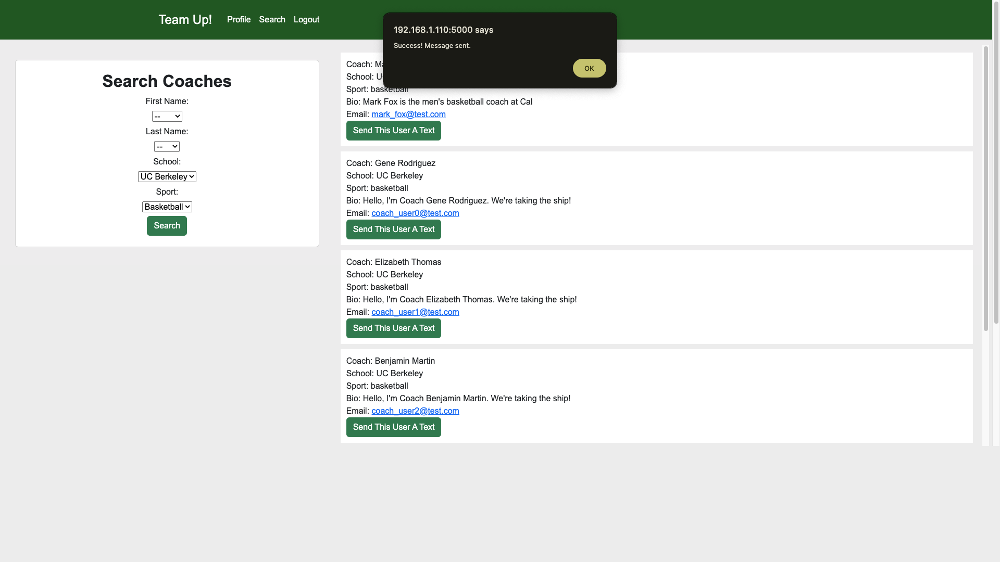
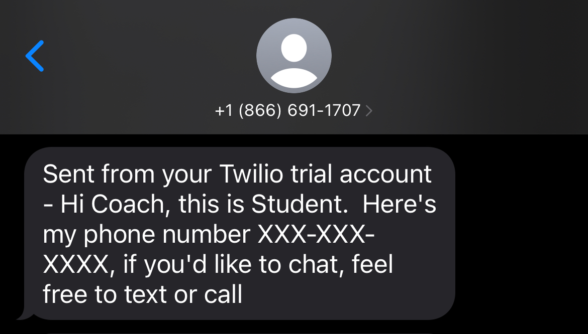

# Team Up!

**_Team Up!_** is a college recruiting app designed to bridge the gap between coaches and student athletes.  Users can create and register their profiles, login, search for other users, and send messages.

### Tech Stack
Back end: Python, Flask, PostgreSQL, SQLAlchemy 
Front end:  Javascript, Jinja2, Bootstrap, AJAX, JSON, HTML5, CSS 
API:  Twilio

### Features
Users can register as a coach or student user and create a profile.
 
 
 

Once a profile is created, users can search for other users based on specific criteria.
 

Users can communicate with others through email or text.  Clicking on a user email opens an email client to send a message.
 

Text messages are sent using the Twilio API by clicking the "Send This User A Text" button.
 
 

### Version 2.0

In future updates, I'd like to implement the following features:

- The ability to send and receive connection requests, as well as storing a user's contact list
- Upload media (pictures and video)
- Allow users to type search criteria
- In-app messaging
